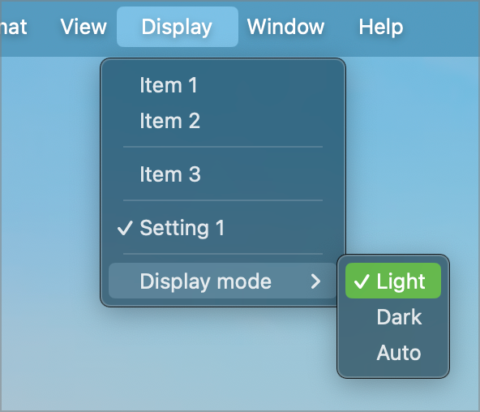
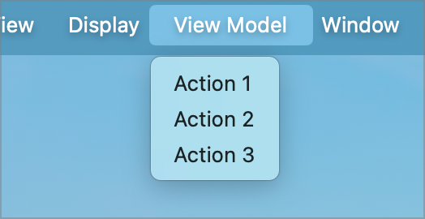
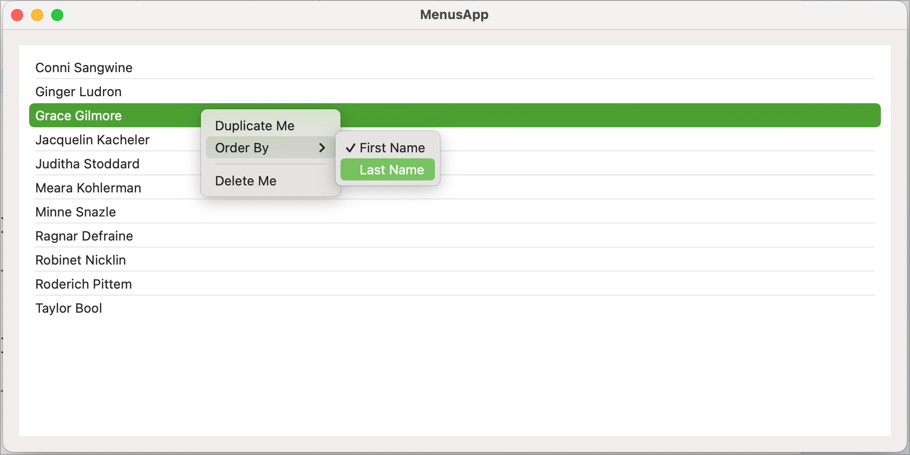

When I started trying to write a Mac app for the first time, I started out knowing what I wanted to achieve but not knowing how to go about it. I spent a lot of time googling for Mac development help and found very little of it. What i did find was mostly related to Objective-C and not Swift/SwiftUI.

So, I spent a lot of time going round in circles, extracting the bits that I thought relevant and heading down a lot of blind alleys.

This project is part of a series of development notes I want to write to document some of the stuff I learnt along the way. The notes that go with it can be found on my web site.

There are three notes. The first deals with menus in general, the second with connecting your menu to the active view and the third with popup context menus:

[Menus](http://www.sabarnett.co.uk/blogPage.php?id=menus)

[Menus and View Models](http://www.sabarnett.co.uk/blogPage.php?id=menuViewModel)

[Context Menus](http://www.sabarnett.co.uk/blogPage.php?id=contextMenus)

### Menus

The Menus note walks you through modifying the existing menus provided by the template MacOS app and shows how to add a custom menu to it.

The note goes on to show how to create toggle switches and to create sub-menus using a Pcker.

### Menus and View Models

A lot can be achieved using simple menus. However, the power of menus comes from being able to interact between the menu and the currently active window (view). In this note, I go over the mechanism that allows a menu to read from a views view model and to call functions in that view model, giving us a simple mechanism to customise and respond to menu items.

### Context Menus

The third note covers the use of popup context menus. These are menus attached to a specific UI element that provide menus with functionality specific to that element.

